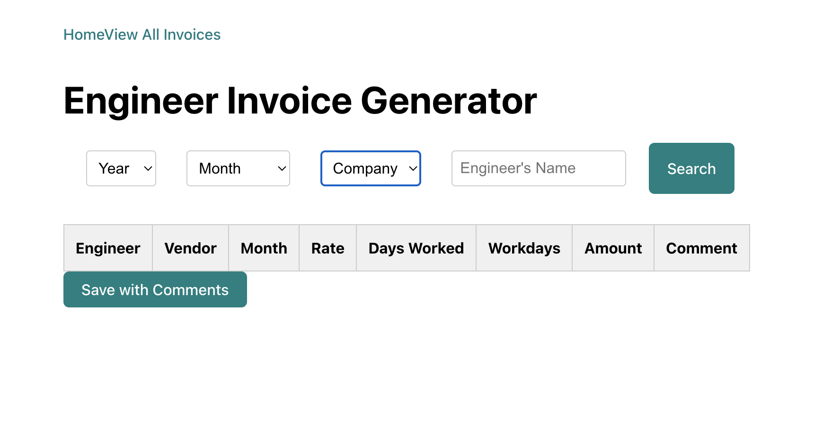
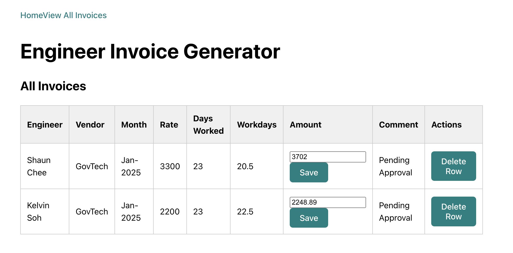

# 🧾 Engineer Invoice Generator

A React application designed as a POC to generate, view and save invoices for engineers.

The app allows users to search, view, edit, and delete invoices, making the invoicing process efficient and streamlined.

---

## 🎮 Screenshots

### Home Page

### All Invoices Page

---

## 🛠️ Technologies Used

- React
- JavaScript (ES6+)
- CSS3
- Airtable API
- Google Sheets Script

---

## 🔗 Demo of POC

Launch engineer invoice generator 👉

---

## 📂 Features

✅ Fetch dropdown values (year, month, company)  
✅ Search and view invoices by engineer or vendor  
✅ Compute and display billing amounts based on attendance  
✅ Add approval comments and save to Airtable  
✅ View saved invoices  
✅ Delete invoices by record ID

---

## 📅 Future Improvements

- [ ] Add loading spinners and Chakra UI elements
- [ ] Enable PDF invoice export

---

## 📖 API References

- [Airtable API](https://airtable.com/developers/web/api/introduction)

---

## 🤝 Acknowledgements

This app was built as part of General Assembly Software engineering bootcamp to help automate workflows for technical program management.

---

Happy Automating! ⚙️
